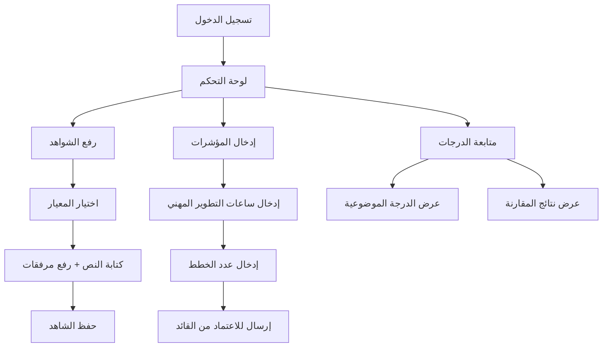
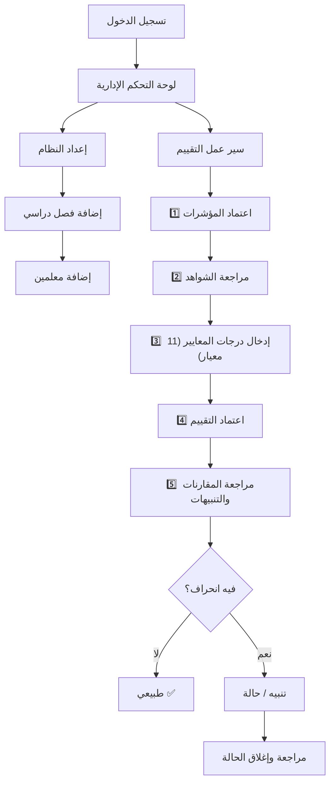
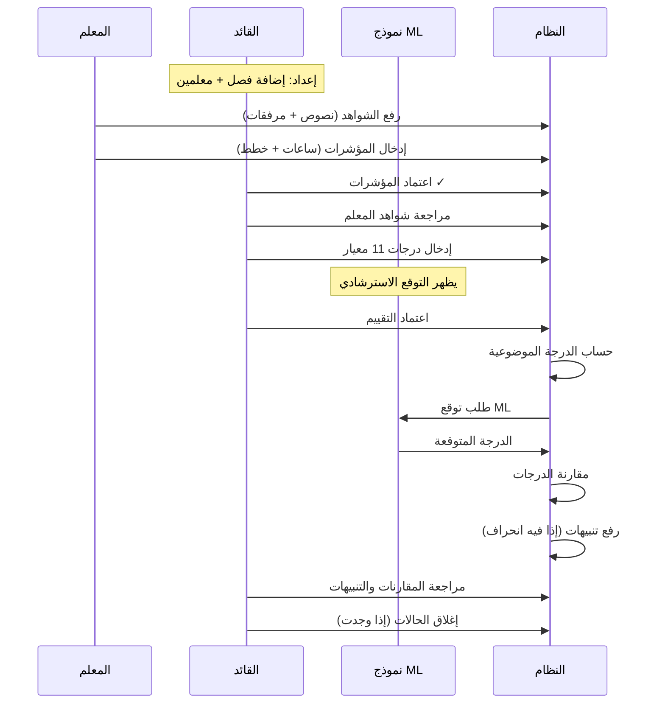

# بصير — رحلة المستخدم والصلاحيات

## الأدوار الثلاثة

| الدور | الوصف | نطاق البيانات |
|---|---|---|
| **TEACHER** (معلم) | يرفع شواهد ومؤشرات لنفسه فقط | بياناته الشخصية فقط |
| **LEADER** (قائد مدرسة) | يقيّم معلمي مدرسته ويدير العملية | معلمو مدرسته فقط |
| **ADMIN** (مدير النظام) | صلاحيات كاملة على كل المدارس | جميع البيانات |

---

## مصفوفة الصلاحيات

| الصفحة | المعلم | القائد | المدير |
|---|:---:|:---:|:---:|
| لوحة التحكم | ✅ (مبسطة) | ✅ (كاملة) | ✅ (كاملة) |
| رفع الشواهد | ✅ (لنفسه) | ❌ | ❌ |
| مراجعة الشواهد | ❌ | ✅ (مدرسته) | ✅ (الكل) |
| المؤشرات — إدخال | ✅ (لنفسه) | ❌ | ❌ |
| المؤشرات — اعتماد | ❌ | ✅ | ✅ |
| التقييمات — إنشاء/تعديل | ❌ | ✅ (مدرسته) | ✅ (الكل) |
| التقييمات — اعتماد | ❌ | ✅ | ✅ |
| الدرجة الموضوعية | ✅ (يشوف درجته) | ✅ (مدرسته) | ✅ (الكل) |
| المقارنات | ✅ (درجته) | ✅ (مدرسته) | ✅ (الكل) |
| التنبيهات (Flags) | ❌ | ✅ | ✅ |
| الحالات (Cases) | ❌ | ✅ | ✅ |
| إدارة المعلمين | ❌ | ✅ (مدرسته) | ✅ (الكل) |
| إدارة الفصول الدراسية | ❌ | ✅ (مدرسته) | ✅ (الكل) |

---

## رحلة المعلم (TEACHER)

### الخطوات التفصيلية

1. **تسجيل الدخول** → يوجَّه للوحة التحكم
2. **لوحة التحكم** → يشوف:
   - نموذج سريع لرفع شاهد
   - آخر 5 شواهد مرفوعة
   - إحصائيات (مؤشرات، درجات، مقارنات)
3. **رفع الشواهد** (`/evidences/`):
   - يختار المعيار من القائمة
   - يكتب نص الشاهد + يرفق ملفات (صور، PDF، فيديو)
   - يقدر يحذف شواهده
   - ⚠️ لازم يكون فيه فصل دراسي نشط، وإلا يظهر خطأ
4. **المؤشرات** (`/metrics/`):
   - يدخل ساعات التطوير المهني + عدد الخطط
   - تنحفظ بحالة "بانتظار الاعتماد"
   - يقدر يعدلها قبل الاعتماد
5. **الدرجات والمقارنات** → يشوف درجاته فقط (للقراءة)

---

## رحلة القائد (LEADER)

### الخطوات التفصيلية

#### مرحلة الإعداد (مرة واحدة)
1. **إدارة الفصول** (`/semesters/manage/`) → إضافة فصل دراسي جديد (اسم + تواريخ + نشط)
2. **إدارة المعلمين** (`/teachers/manage/`) → إضافة حسابات معلمين (اسم مستخدم + كلمة مرور + رقم وظيفي)

#### سير عمل التقييم (لكل معلم)

| الخطوة | الصفحة | الوصف |
|---|---|---|
| **1/4** | `/metrics/` | اعتماد المؤشرات اللي أدخلها المعلم (pd_hours, plans_count) |
| **2/4** | `/evaluations/` → بدء التقييم | إنشاء تقييم جديد أو استكمال مسودة |
| | `/evaluations/{id}/items/` | إدخال درجات الـ 11 معيار (1-5 لكل معيار) + مراجعة الشواهد + **رؤية توقع ML** |
| **3/4** | `/evaluations/{id}/finalize/` | اعتماد التقييم → يحسب تلقائياً: الدرجة الموضوعية + المقارنة + ML |
| **4/4** | `/comparisons/` | مراجعة الفرق بين درجته والدرجة الموضوعية ودرجة ML |

#### مرحلة المراجعة
5. **التنبيهات** (`/flags/`) → مراجعة التنبيهات (انحراف عالي / مراجعة)
6. **الحالات** (`/cases/`) → مراجعة الحالات المفتوحة
7. **إغلاق حالة** (`/cases/{id}/close/`) → كتابة ملاحظة القرار وإغلاق

---

## رحلة المدير (ADMIN)

نفس رحلة القائد بالضبط لكن:
- يشوف **كل المدارس** (مو بس مدرسته)
- يقدر يدير معلمين وفصول لأي مدرسة

---

## سير العمل الكامل (End-to-End)

---

## 🐛 مشاكل مكتشفة من مراجعة الواجهة

### ❌ مشكلة حرجة
| المشكلة | الصفحة | التفاصيل |
|---|---|---|
| **خطأ 500** | `/evidences/admin/` | `InvalidStorageError` — مشكلة في إعدادات التخزين |

### ⚠️ مشاكل ترجمة
| العنصر | يظهر حالياً | المقترح |
|---|---|---|
| حالة التقييم | DRAFT / FINAL | مسودة / نهائي |
| شدة التنبيه | HIGH_RISK / REVIEW | مخاطرة عالية / يحتاج مراجعة |
| حالة القضية | OPEN / CLOSED | مفتوحة / مغلقة |
| رسائل التنبيهات | بالإنجليزية | يفضل ترجمتها للعربية |

